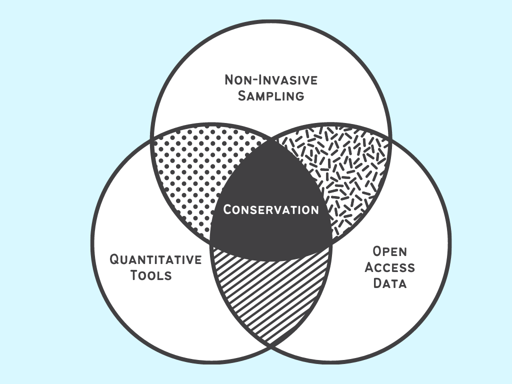

# Julia Saltzman 
## Quantitative Tools for Marine Conservation 

### About Me 
- I am _conservation biologist_ using _quantitative tools_ to address conservation issues. 
- I am currently a masters student in the Dr. Easton White's Quantitative Marine Ecology Lab at the University of New Hampshire. 
- I do freelance consulting work in science communication, data visualization, graphic design, publication editing, and formatting. 
- My current research focuses on the _population monitoring and modelling of shark and ray populations_ in the Eastern Tropical Pacific.
- I am passionate _education and outreach_. I currently work with Terranaut Club, where I help facilitate immersive experiences in science and nature for girls+.


## My Research 


###  _Environmental Influences on Planktivorous Elasmobranchs: a Case Study of Isla del Coco— an Isolated Marine Protected Area
I 

### _Non Invasive Tools_

I am interested in using novel and noninvasive tools to study species and ecosystems which are logistically difficult and costly to study. 

#### Unmanned Aerial Vehicles
_Using drones, I study the behavior, specifically the aggregations of Atlantic tarpon off the Coast of Miami. This is a figure from Saltzman et al. 2021, which is in prep for submission to Southeastern Naturalist._


## Publications 
1. Whitenack, L. B., Mickley, B. L., **Saltzman, J.**, Kajiura, S. M., Macdonald, C. C., & Shiffman, D. S. (2021). Sharks, Lies, and Videotape: A content analysis of 32 years of Shark Week documentaries. BioRxiv, 2021.08.18.456878. https://doi.org/10.1101/2021.08.18.456878 {In Review at PLOS One}

You can use the [editor on GitHub](https://github.com/juliasaltzman1/JuliaSaltzman/edit/gh-pages/index.md) to maintain and preview the content for your website in Markdown files.

Whenever you commit to this repository, GitHub Pages will run [Jekyll](https://jekyllrb.com/) to rebuild the pages in your site, from the content in your Markdown files.

### Markdown

Markdown is a lightweight and easy-to-use syntax for styling your writing. It includes conventions for

```markdown
Syntax highlighted code block

# Header 1
## Header 2
### Header 3

- Bulleted
- List

1. Numbered
2. List

**Bold** and _Italic_ and `Code` text

[Link](url) and 
```

For more details see [GitHub Flavored Markdown](https://guides.github.com/features/mastering-markdown/).

### Jekyll Themes

Your Pages site will use the layout and styles from the Jekyll theme you have selected in your [repository settings](https://github.com/juliasaltzman1/JuliaSaltzman/settings/pages). The name of this theme is saved in the Jekyll `_config.yml` configuration file.

### Support or Contact

Having trouble with Pages? Check out our [documentation](https://docs.github.com/categories/github-pages-basics/) or [contact support](https://support.github.com/contact) and we’ll help you sort it out.
