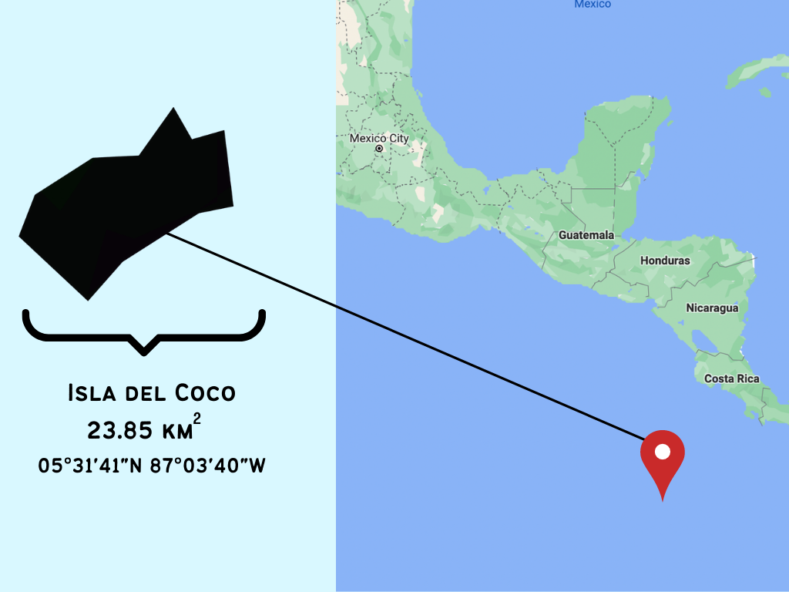

# Julia Saltzman 
## Quantitative Tools for Marine Conservation 

### About Me 
- I am _conservation biologist_ using _quantitative tools_ to address conservation issues. 
- I am currently a masters student in the Dr. Easton White's Quantitative Marine Ecology Lab at the University of New Hampshire. 
- I do freelance consulting work in science communication, data visualization, graphic design, publication editing, and formatting. 
- My current research focuses on the _population monitoring and modelling of shark and ray populations_ in the Eastern Tropical Pacific.
- I am passionate _education and outreach_. I currently work with Terranaut Club, where I help facilitate immersive experiences in science and nature for girls+.

## My Research 

###  _Environmental Influences on Planktivorous Elasmobranchs: a Case Study of Isla del Coco— an Isolated Marine Protected Area_

My masters research will focus on the enviornmental factors which influences filter-feeding elasmobranchs (whale sharks, manta rays, mobula eays). By employing statsical models, I hope to understand if these charasmatic megafauna can tell us information about events such as fish spawning aggregations. This study will use data taken over the last twenty years by Undersea Hunter, a dive charter at Isla del Coco or Cocos Island. As the oldest MPA, studying the shark assemblages at Cocos provides the unique opportunity to monitor the efficacy of a MPA over throughout many years of protection. 

### _Non-Invasive Tools_

I am interested in using novel and noninvasive tools to study species and ecosystems which are logistically difficult and costly to study. 

#### Unmanned Aerial Vehicles
_Using drones, I study the behavior, specifically the aggregations of Atlantic tarpon off the Coast of Miami. This is a figure from Saltzman et al. 2021, which is in prep for submission to Southeastern Naturalist._

#### Social Media Surveys 
_I am currently working on a collaborative project which uses social media surveys to montitor interactions, perceptions, movements, and habitat use of critically endangered species._

#### Underwater Video Stations 

## Freelance Consulting 
_I do freelance "figure making", "formatting", and "design" for several scientists, and the Office of Research and Large Center Development at the University of New Hampshire. If you are interested in this, get into contact with me and I will share rates, and examples of my work!_

## Publications 
1. Whitenack, L. B., Mickley, B. L., **Saltzman, J.**, Kajiura, S. M., Macdonald, C. C., & Shiffman, D. S. (2021). Sharks, Lies, and Videotape: A content analysis of 32 years of Shark Week documentaries. BioRxiv, 2021.08.18.456878. https://doi.org/10.1101/2021.08.18.456878 {In Review at PLOS One}
2. **Saltzman, J.** & Macdonald, C. (2021). Using drones to elucidate spawning patterns of Atlantic Tarpon Megalops atlanticus. In Submission. 
3. **Saltzman, J.**, Wester, J., White, E.R., & Macdonald, C. (2021). #Sawfish: Social Media as a Tool for Endangered Species Monitoring and Assessment of Public Behavior and Attitudes. In Prep. Conservation Science in Practice.

## Outreach, Education, and Service 

#### Terranaut Club 
I work with low-income students and manage social media outreach for Terranaut Club, a non-profit encouraging scientific engagement for gender minorities through experiential education.
#### Laurel School 
I serve as a mentor for the capstone program at Laurel, an independent research project completed by high school students over the course of four years with the guidance of a mentor in the respective field. 
#### Skype a Scientist 
I am a scientist for Skype-a-Scientist, and give weekly presentations to students in grades K-12 about sharks and ocean conservation 

## Presentations and Conference Talks 
- **Saltzman, J.**  (October 2021). Non-Invasive Methods of Shark Research. University of New Hampshire: Department of Biological Sciences Graduate Student Seminar 
- **Saltzman, J.** (July 2021). Beyond Tagging: Non-Traditional Methods for Studying Sharks. Cornell University/University of New Hampshire: Shoals Marine Laboratory, Shark Biology Course 
- Whitenack, L., Mickey, B., **Saltzman, J.**, Kajiura, S., Macdonald, C., Shiffman, D. (2021). Sharks, Lies, and Videotape: Analysis of 32 Years of Shark Week Documentaries. American Elasmobranch Society Conference (AES), society conference. 
- **Saltzman, J.** & Macdonald, C. (2021). Using drones to elucidate spawning patterns of Atlantic Tarpon Megalops atlanticus. Rosenstiel School Research Symposium, institutional conference. 
- **Saltzman, J.** & Hammerschlag, N. (2020). Investigating the distributional abundance of teleost fishes in Biscayne Bay and its potential influence on shark habitat use. Florida Universities Elasmobranch Symposium (FUSES), regional conference. 
- **Saltzman, J.** & Hammerschlag, N. (2020). Using baited remote underwater videos to assess potential influence of prey abundance on shark habitat use. Rosenstiel School Research Symposium, institutional conference

## Want to learn more? Download my most recent CV here: 

